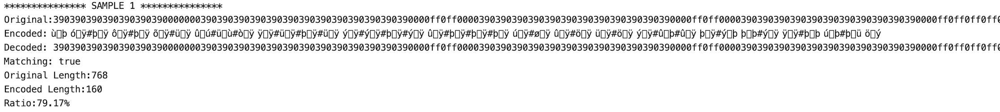
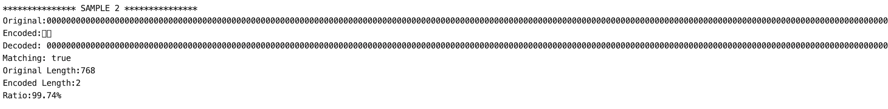

# PixelMap_Compression
Compression algorithm to convert the 16x16 image string of PixelMap.io into a shorter string in order to solve the PixelMap.io Compression Challenge.

## Background
The PixelMap.io Compression challenge is described [here](https://pixelmap.medium.com/tiles-hex-triplets-gas-prices-and-the-compression-contest-3adcfebcf3ac); 
## Implementation
This implementation does two steps, taking advantage to the fact that there are 256 UTF-8 characters:
   1) Convert the colors into a single UTF-8 character. There are only 216 colors from the [web safe colors](https://htmlcolorcodes.com/color-chart/web-safe-color-chart/).
   2) Compress the string of 256 UTF-8 characters by counting consecutive colors, and storing this number again into a UTF-8 character. 

This means that in the worse case scenario, the algorithm will return a string of 512 characters, and in the best case scenario only 2 characters (an image with a unique color).

### Colors

The 216 colors are mapped to a number between 0 and 215. The colors are currently expressed with a triplet where each value can only be 
one of the following 6 hex characters ['0', '3', '6', '9', 'c', 'f']. Therefore, replacing the triplet character by its index in the array ['0', '3', '6', '9', 'c', 'f'], 
we get the number expressed in base 6. As an example, 'ff0' becomes 055 (inverted), which is 0 * 36 + 5 * 6 + 5 = 35. Then calling String.fromCharCode(35), we get the character '#'.

### Repetition

The number of times a color is used in a row is also counted. This number is then converted into one of the 256 UTF-8 charaters and stored after the color. Since there are only 256 pixels in the image, the case where an image consists of always the same color is covered.
### Examples
```
********************** SAMPLE 1 **********************
[
  '390390390390390390390000000390390390390390390390',
  '390390390390390390000ff0ff0000390390390390390390',
  '390390390390390390000ff0ff0000390390390390390390',
  '390390390390390000ff0ff0ff0ff0000390390390390390',
  '000000000000000000ff0ff0ff0ff0000000000000000000',
  '000ff0ff0ff0ff0ff0ff0ff0ff0ff0ff0ff0ff0ff0ff0000',
  '390000ff0ff0ff0ff0000ff0ff0000ff0ff0ff0ff0000390',
  '390390000ff0ff0ff0000ff0ff0000ff0ff0ff0000390390',
  '390390390000ff0ff0000ff0ff0000ff0ff0000390390390',
  '390390390000ff0ff0ff0ff0ff0ff0ff0ff0000390390390',
  '390390000ff0ff0ff0ff0ff0ff0ff0ff0ff0ff0000390390',
  '390390000ff0ff0ff0ff0ff0ff0ff0ff0ff0ff0000390390',
  '390000ff0ff0ff0ff0ff0000000ff0ff0ff0ff0ff0000390',
  '390000ff0ff0ff0000000390390000000ff0ff0ff0000390',
  '000ff0ff0000000390390390390390390000000ff0ff0000',
  '000000000390390390390390390390390390390000000000'
]

```


**Ken's example image is now only 160 characters! 
Compression rate of 79.17%!**

```
********************** SAMPLE 2 **********************
[
  '000000000000000000000000000000000000000000000000',
  '000000000000000000000000000000000000000000000000',
  '000000000000000000000000000000000000000000000000',
  '000000000000000000000000000000000000000000000000',
  '000000000000000000000000000000000000000000000000',
  '000000000000000000000000000000000000000000000000',
  '000000000000000000000000000000000000000000000000',
  '000000000000000000000000000000000000000000000000',
  '000000000000000000000000000000000000000000000000',
  '000000000000000000000000000000000000000000000000',
  '000000000000000000000000000000000000000000000000',
  '000000000000000000000000000000000000000000000000',
  '000000000000000000000000000000000000000000000000',
  '000000000000000000000000000000000000000000000000',
  '000000000000000000000000000000000000000000000000',
  '000000000000000000000000000000000000000000000000',
]

```


### Warning
I think that Solidity should be able to digest all the weird UTF-8 characters, but I am not 100% sure. :)

## Credit
I was inspired by the following two other solutions:
1. https://github.com/robinbihun/pixelmap.imagelib#readme
2. https://gist.github.com/pinealan/ad6de2d01fcc5d4ebc0396d3dd4da074